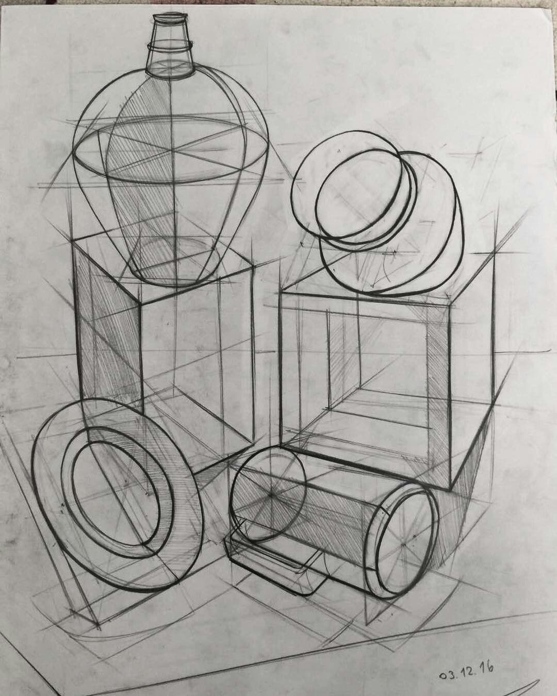
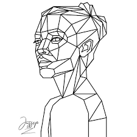
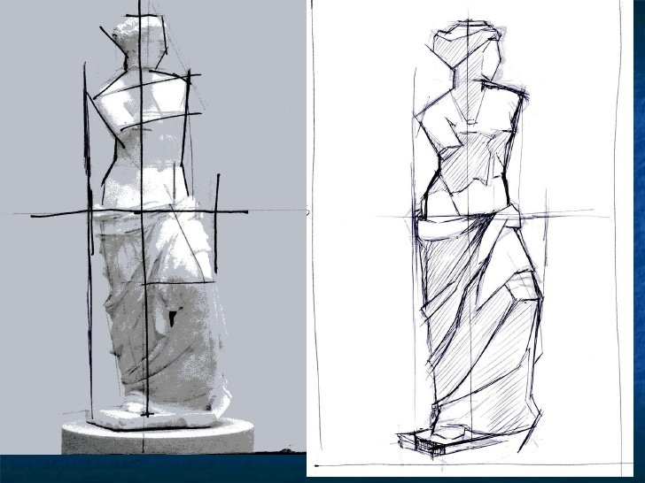
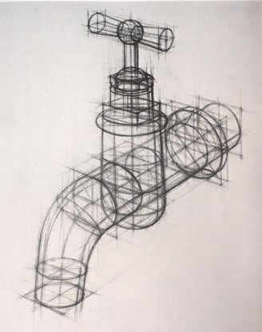
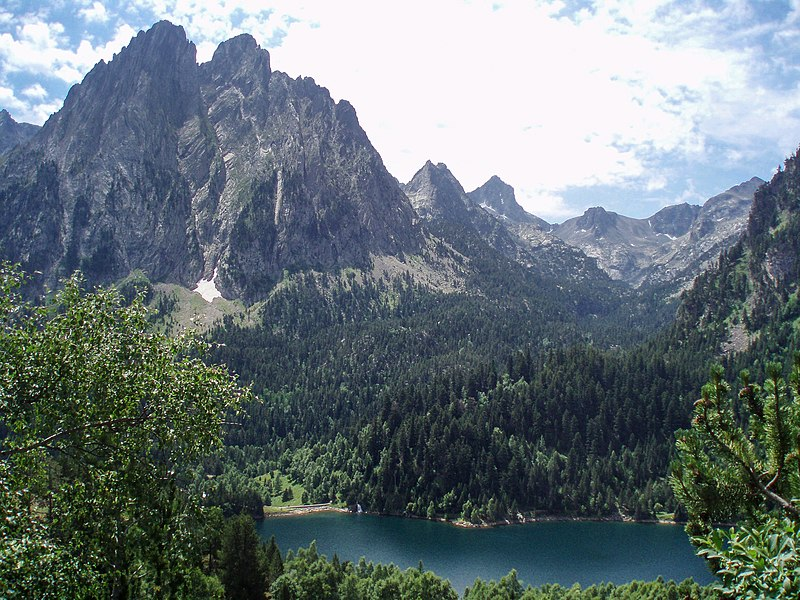

# Formas naturales

Son formas que están presentes en la naturaleza tales como nubes arboles, animales, cosas en general.

```{definition, formasnaturales, name="Formas naturales"}
Son objetos presentes en la naturaleza manisfestandose como elementos que interactuan en nuestro entorno.
```

## Geometrización

La geometrización es el proceso de manifestar poligonos y lineas sobre los objetos naturales 2d y 3d. Este proceso es la simplificación del objeto con el objetivo de poder aplicar criterios de proporcionalidad y otras trasformaciones elementales que puedan realizarse sobre el objeto. La simplificación podría incluso ser una linea o una estructura poligonal compleja. La geometrización se realiza desde un punto de vista especifico en el caso bidimensional y toda la forma en el caso tridimensional.

El objetivo es aprender a geometrizar diversos objetos 3d con el objetivo de trasformarlos.

```{r geometrizacion, echo=FALSE, fig.cap="Elipse", fig.pos ="!ht", fig.align="center"}




```
<!-- 


 -->


## Geomorfologia

```{definition, www2, name="Geomorfología"}
La geomorfología es una rama de la geografía1 y de la geología que tiene como objetivo el estudio de las formas de la superficie terrestre enfocado en describir, entender su génesis y su actual comportamiento.
```
La geomorfología es una rama de la geografía y de la geología que tiene como objetivo el estudio de las formas de la superficie terrestre enfocado en describir, entender su génesis y su actual comportamiento.

### Factores generadores de los procesos geomorfológicos


- **Factores geográficos:** Factores *bióticos* como *abióticos*, son propiamente geográficos aquellos *abióticos* de origen exógeno, tales como la *gravedad*, el suelo, el clima y los cuerpos de agua. El clima con sus elementos tales como la *presión*, la *temperatura*, la *humedad*, los vientos. El *agua superficial*. Son factores que ayudan al modelado, favoreciendo los procesos erosivos.
- **Factores bióticos**
- **Factores geológicos:** Tales como la tectónica, el diastrofismo, la orogénesis y el vulcanismo, son procesos constructivos y de origen endógeno que se oponen al modelado e interrumpen el ciclo geográfico
- **Factores antrópicos**


### Ramas de la geomorfología

* **Geomorfología climática**: Estudia la influencia del clima en el desarrollo del relieve. La presión atmosférica y la temperatura interactúan con el clima y son los responsables de los vientos, las escorrentías y del continuo modelado del ciclo geográfico. La diversidad de climas representa distintas de velocidades en la evolución del ciclo, como es el caso de los climas áridos con ritmo evolutivo más lentos y de los climas muy húmedos con ritmos evolutivos más altos, como también el clima representa el tipo de modelado predominante; glacial, eólico, fluvial, etc. Este conocimiento se sintetiza en lo que se denomina «dominios morfoclimáticos.

* **Geomorfología fluvial**: Estudio de formas y relieves ocasionados por la dinámica fluvial. ~ hidrografía.

* **Geomorfología de laderas**: Estudia los fenómenos producidos en las vertientes de las montañas, movimientos en masa, estabilización de taludes, etc.  riesgos naturales.

* **Geomorfología eólica**: Estudiar los procesos y las formas de origen eólico, en las zonas litorales, los desiertos fríos y cálidos, y las zonas polares.

* **Geomorfología glaciar**: se encarga de estudiar las formaciones y los procesos de los accidentes geográficos, formas y relieves glaciares y periglaciares. Esta rama está íntimamente ligada con la glaciología.

* **Geomorfología estructural**: Prioriza la influencia de estructuras geológicas en el desarrollo del relieve. Esta disciplina es muy relevante en zonas de marcada actividad geológica donde por ejemplo fallas y plegamientos predeterminan la existencia de cumbres o quebradas, o la existencia de bahías y cabos se explica por la erosión diferencial de afloramientos de roca más o menos resistentes.  geología

* **Geomorfología litoral**: estudia las formas del relieve propias de las zonas costeras.


```{r wwUUU, echo=FALSE, fig.cap="WWWWWWWWW", fig.pos ="!ht", fig.align = "center"}

```


<!--  -->

[Geomorfologia 1](https://sketchfab.com/3d-models/eldgos-i-geldingadolum-a-reykjanesskaga-7bcb3d856e1947a4a78c1810f559b3ea)


<div class="sketchfab-embed-wrapper"> <iframe title="Wariewood Outfall 12/01/2017" frameborder="0" allowfullscreen mozallowfullscreen="true" webkitallowfullscreen="true" allow="fullscreen; autoplay; vr" xr-spatial-tracking execution-while-out-of-viewport execution-while-not-rendered web-share width="100%" height="480" src="https://sketchfab.com/models/6836256ac39d4821b40b3414f9a7715e/embed"> </iframe> <p style="font-size: 13px; font-weight: normal; margin: 5px; color: #4A4A4A;"> <a href="https://sketchfab.com/3d-models/wariewood-outfall-12012017-6836256ac39d4821b40b3414f9a7715e?utm_medium=embed&utm_campaign=share-popup&utm_content=6836256ac39d4821b40b3414f9a7715e" target="_blank" style="font-weight: bold; color: #1CAAD9;"> Wariewood Outfall 12/01/2017 </a> by <a href="https://sketchfab.com/chrisdrummond?utm_medium=embed&utm_campaign=share-popup&utm_content=6836256ac39d4821b40b3414f9a7715e" target="_blank" style="font-weight: bold; color: #1CAAD9;"> chrisdrummond </a> on <a href="https://sketchfab.com?utm_medium=embed&utm_campaign=share-popup&utm_content=6836256ac39d4821b40b3414f9a7715e" target="_blank" style="font-weight: bold; color: #1CAAD9;">Sketchfab</a></p></div>

## Fitomorfologia

```{definition, ww3, name="Formas naturales"}
La Fitomorfologia, en sentido amplio, se define como el estudio de la estructura y forma de las plantas, e incluye la Citología y la Histología. La primera se ocupa del estudio fino de la constitución de la célula y la segunda del estudio de los tejidos. Citología e Histología, conjuntamente, son necesarias para comprender la anatomía vegetal, o sea, su constitución interna y, además, son un complemento de la organografía, exomorfología o morfología en sentido estricto, que trata de la forma externa de las plantas
```
La Morfología vegetal, en sentido amplio, se define como el estudio de la **estructura** y forma de las plantas, e incluye la Citología y la Histología. La primera se ocupa del estudio fino de la constitución de la célula y la segunda del estudio de los tejidos. Citología e Histología, conjuntamente, son necesarias para comprender la anatomía vegetal, o sea, su constitución interna y, además, son un complemento de la organografía, **exomorfología**	 o morfología en sentido estricto, que trata de la forma externa de las plantas

### Metodos
Las plantas nos ofrecen una infinidad de formas particulares y el objetivo de la morfología es descubrir los patrones o regularidades generales en el fondo de tal diversidad, asimismo comprender y describir tal diversidad desde varios puntos de vista. Para alcanzar este fin se pueden seguir dos caminos:

* Secuencias

* Morfogenesis

### Organización del cuerpo de la planta

El cuerpo de las plantas vasculares está marcadamente polarizado y formado por dos porciones básicas: un vástago orientado hacia la luz, que vive en ambiente aéreo, compuesto por tallo y hojas, y una raíz, órgano de fijación y absorción que vive en el suelo. Este tipo de cuerpo vegetativo se llama cormo y se presenta en las pteridófitas y en las espermatófitas, que por eso se llaman también cormófitos.

Es difícil hacer una distinción entre tallo y hojas, ambos órganos tienen origen común en el meristema apical caulinar, y están relacionados con estrecha dependencia a lo largo de todo su período de crecimiento. Por eso tallo y hojas se consideran como una unidad que constituye el vástago.

En las espermatófitas la diferenciación entre raíz y vástago aparece ya en el embrión joven. Las partes del embrión son radícula, hipocótilo, cotiledones y plúmula. En algunos casos se distingue también el primer entrenudo, entre el nudo cotiledonar y la plúmula: el epicótilo. Durante la germinación el embrión crece, la radícula formará la raíz primaria y la plúmula formará el vástago.


## Zoomorfologia

Animales estructura muscular y osea  locomoción

